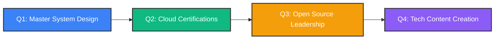

<div align="center">
  
</div>

<div align="center">
  
</div>

<br>

<p align="center">
  
</p>

<div align="center">
  
[](https://github.com/mehedidevx)
[](https://github.com/mehedidevx?tab=followers)
[](https://github.com/mehedidevx)
[](https://wakatime.com/@mehedidevx)

</div>

---

## 👨‍💻 About Me

<table>
<tr>
<td width="55%" valign="top">

```javascript
class Developer {
  constructor() {
    this.name = "Md Mehedi Hasan";
    this.title = "Frontend Architect";
    this.location = "Rangpur, Bangladesh 🇧🇩";
    this.workingOn = "Enterprise-grade MERN Applications";
    this.learning = ["System Design", "Microservices", "Cloud Architecture"];
    this.askMeAbout = ["React", "Next.js", "TypeScript", "Node.js"];
  }

  get skillset() {
    return {
      languages: ["JavaScript", "TypeScript", "Python"],
      frontend: {
        frameworks: ["React 18+", "Next.js 14", "Vue 3"],
        styling: ["Tailwind CSS", "Styled Components", "SASS"],
        stateManagement: ["Redux Toolkit", "Zustand", "React Query"]
      },
      backend: {
        runtime: ["Node.js", "Express", "NestJS"],
        databases: ["MongoDB", "PostgreSQL", "Redis"],
        authentication: ["JWT", "OAuth 2.0", "Passport.js"]
      },
      devOps: ["Docker", "AWS", "Vercel", "GitHub Actions"],
      tools: ["Git", "VS Code", "Postman", "Figma"]
    };
  }

  get currentFocus() {
    return [
      "🎯 Building production-ready SaaS platforms",
      "📚 Mastering design patterns and architecture",
      "🌟 Contributing to impactful open source projects",
      "🤝 Mentoring aspiring developers"
    ];
  }

  contact() {
    return {
      email: "mehedi.devx@gmail.com",
      whatsapp: "+8801780524217",
      portfolio: "Coming Soon",
      availability: "Open for opportunities"
    };
  }
}

const mehedi = new Developer();
console.log(mehedi.currentFocus);
```

</td>
<td width="45%" valign="top">

<div align="center">


### 🎯 Current Status

```yaml
🚀 Status: Building & Shipping
💼 Role: Full-Stack Developer
🎓 Focus: React Ecosystem
📍 Based: Rangpur, BD
⚡ Superpower: Clean Code
```

### 📊 Quick Stats

**500+** Commits This Year  
**50+** Repositories  
**20+** Projects Completed  
**10+** Happy Clients  

</div>

</td>
</tr>
</table>

---

## 🛠️ Technology Stack

<div align="center">

### Frontend Development


### Styling & UI


### Backend & Database


### Tools & DevOps


</div>

---

## 📊 GitHub Statistics

<div align="center">
  


</div>

<br>

<div align="center">
  


</div>

<br>

<div align="center">
  
</div>

<br>

<p align="center">
  
</p>

---

## 🏆 Achievements

<div align="center">
  
</div>

---

## 💼 Professional Services

<div align="center">

| Service | Description | Status |
|---------|-------------|--------|
| 🎨 **Frontend Development** | Building responsive, performant React applications | ✅ Available |
| ⚙️ **Full-Stack Solutions** | Complete MERN stack applications with authentication | ✅ Available |
| 🚀 **Performance Optimization** | Speed up your existing React/Next.js applications | ✅ Available |
| 📱 **Responsive Design** | Pixel-perfect, mobile-first UI development | ✅ Available |
| 🔧 **API Development** | RESTful APIs with Express & MongoDB | ✅ Available |
| 📚 **Code Review & Mentoring** | Help junior developers level up their skills | ✅ Available |

</div>

---

## 🎯 2025 Roadmap

<div align="center">



### 🎓 Learning Goals
**Advanced React Patterns** • **Microservices Architecture** • **AWS Solutions Architect** • **GraphQL & Apollo** • **Testing Best Practices**

### 🚀 Project Goals
**5 Major Open Source Contributions** • **3 Production SaaS Apps** • **Personal Portfolio V2** • **Developer Blog Launch** • **YouTube Channel**

### 📈 Career Goals
**Senior Frontend Role** • **Tech Conference Speaker** • **Mentorship Program** • **Building in Public** • **Global Network**

</div>

---

## 📫 Let's Connect

<div align="center">

### 🌐 Find Me Around The Web

<p>
  <a href="https://www.linkedin.com/in/mehedidevy/">
    
  </a>
  <a href="https://www.facebook.com/mehedidevx">
    
  </a>
  <a href="mailto:mehedi.devx@gmail.com">
    
  </a>
  <a href="https://wa.me/8801780524217">
    
  </a>
  <a href="https://twitter.com/mehedidevx">
    
  </a>
  <a href="#">
    
  </a>
</p>

### 💡 Open For

<table>
<tr>
<td align="center" width="25%">
<br>
<b>Full-Time Jobs</b><br>
<sub>Remote or On-site</sub>
</td>
<td align="center" width="25%">
<br>
<b>Freelance Projects</b><br>
<sub>Available Now</sub>
</td>
<td align="center" width="25%">
<br>
<b>Collaborations</b><br>
<sub>Let's Build Together</sub>
</td>
<td align="center" width="25%">
<br>
<b>Mentorship</b><br>
<sub>Knowledge Sharing</sub>
</td>
</tr>
</table>

### ⚡ Response Time


</div>

---

## 💭 Words I Code By

<div align="center">

> *"Any fool can write code that a computer can understand. Good programmers write code that humans can understand."*  
> — Martin Fowler

> *"First, solve the problem. Then, write the code."*  
> — John Johnson

> *"Code is like humor. When you have to explain it, it's bad."*  
> — Cory House

> *"Make it work, make it right, make it fast."*  
> — Kent Beck

</div>

---

## 🎨 Support My Work

<div align="center">

**If you find my work valuable, consider:**

⭐ **Star** my repositories • 🍴 **Fork** interesting projects • 👁️ **Watch** for updates  
🤝 **Contribute** to open source • 💬 **Share** with your network • ☕ **Buy me a coffee**

<br>


### 🚀 Let's Build Something Extraordinary!

**Got an exciting project? Let's turn your vision into reality.**

<a href="mailto:mehedi.devx@gmail.com">
  
</a>

</div>

---

<div align="center">
  


</div>

<br>


<div align="center">
  


**Last Updated:** October 2025 • **Version:** 2.0 • **Status:** Active


</div>
